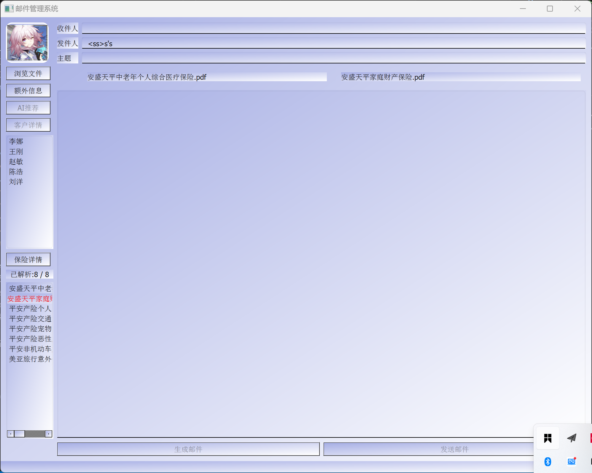

# 开发说明
主分支为main，个人请创建自己的分支，不要直接在主分支上修改，验证无误后由管理员合并到主分支

# 账号准备
1. QQ邮箱账号
2. 获取qq邮箱授权码（非密码）,方式如下：
登录邮箱（网页版）=> 邮箱设置 => 账号 => POP3/IMAP/SMTP/Exchange/CardDAV/CalDAV服务 获取授权码
3. 获取智谱api key：智谱AI开放平台 (bigmodel.cn)

# 使用
1. 点击头像进行登录，登录账号用于发送邮件，并输入api key用于智能邮件的生成
2. 输入附加信息（产品信息和优惠信息），点击生成邮件即可调用glm4-flash生成邮件
3.侧边栏展示用户，点击可选择该用户，点击详情可以查看用户详情，点击发送邮件可以发送邮件
4. 点击文件可以读入文件，读入文件后未进行处理：TODO

